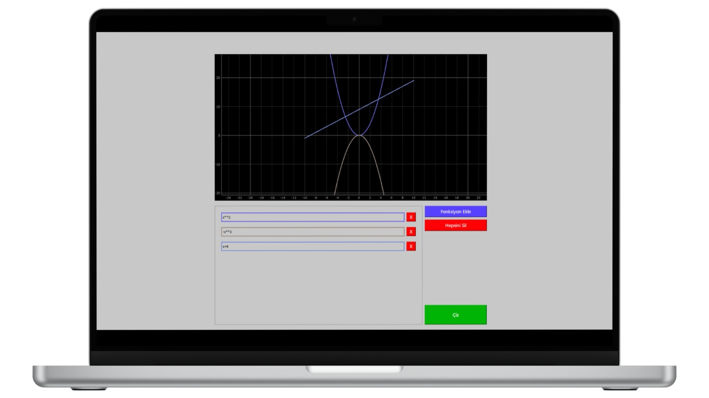

# Fonksiyon çizme uygulaması!

Kullanışlı fonksiyon çizmenize yardımcı olacak bir program birden fazla fonksiyonun grafiğini görmenizi sağlayacak.

# Kurulum

- Projeyi yükleyelim. `[git clone ](https://github.com/yasirkaramandev/fonksiyon.git)`

- Gerekli kütüphaneleri indirelim. `pip install -r requeriments.txt`
- Ve hazırız! Deneyelim. `python fonksiyonmain.py`

# Kullanım

Bilgisayarlarda bir sayının karesi x² -> x**2 şeklinde yazılır aynı şekilde bütün üslü sayılar x\*\*3 ,4 ,5... şeklinde ifade edilir. Örneğin 6x² + 5x + 12 grafiğini görmek istiyorsanız 6*x\*\*2 + 5\*x +12 şeklinde yazılmalıdır.

# Lisance
Bu proje MIT lisansı altındadır.
